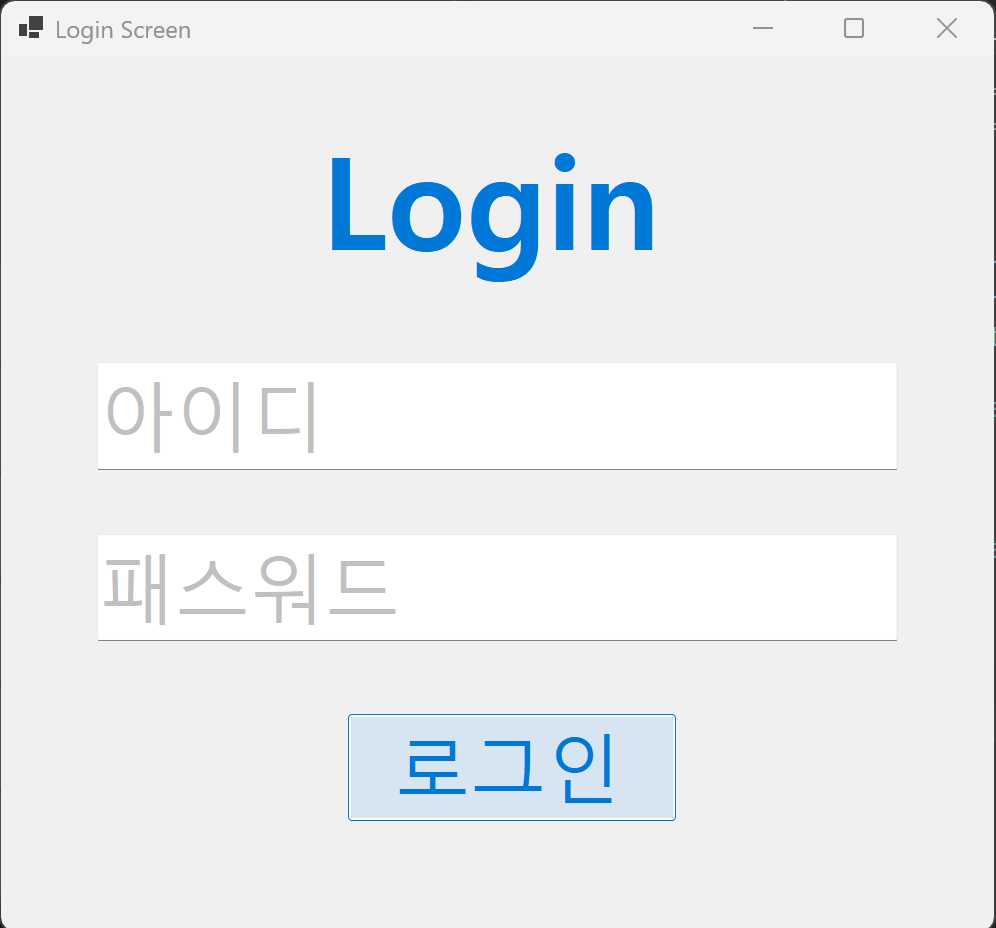
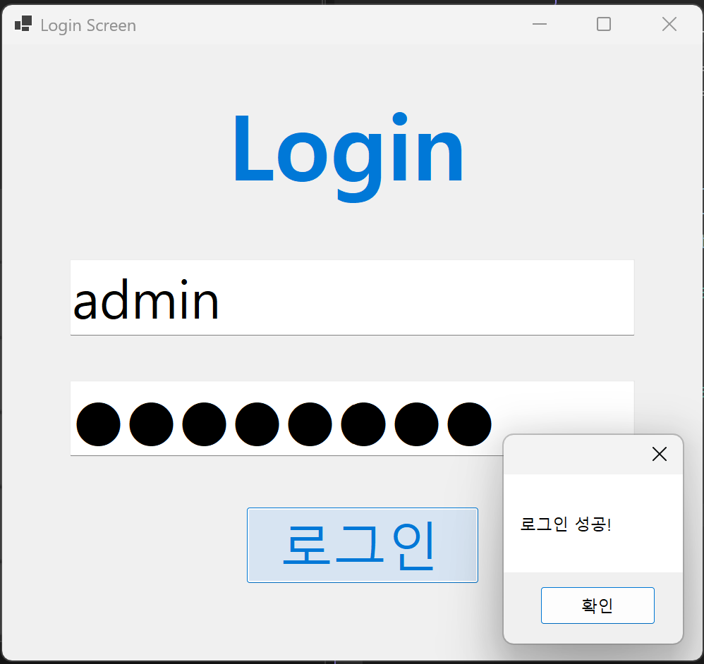
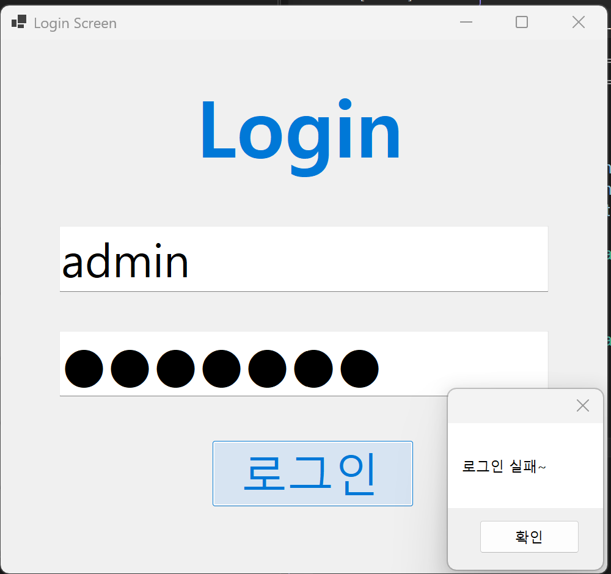
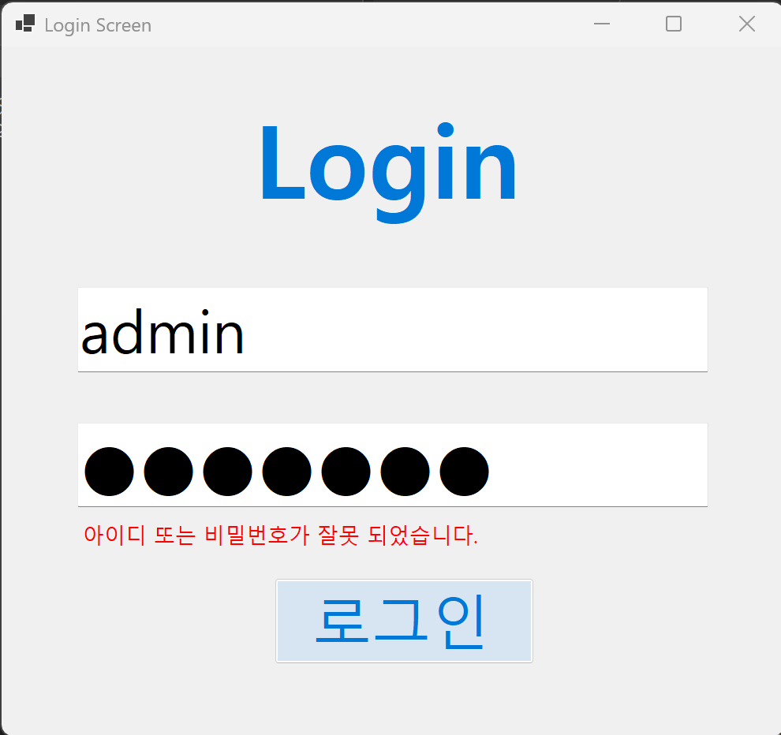
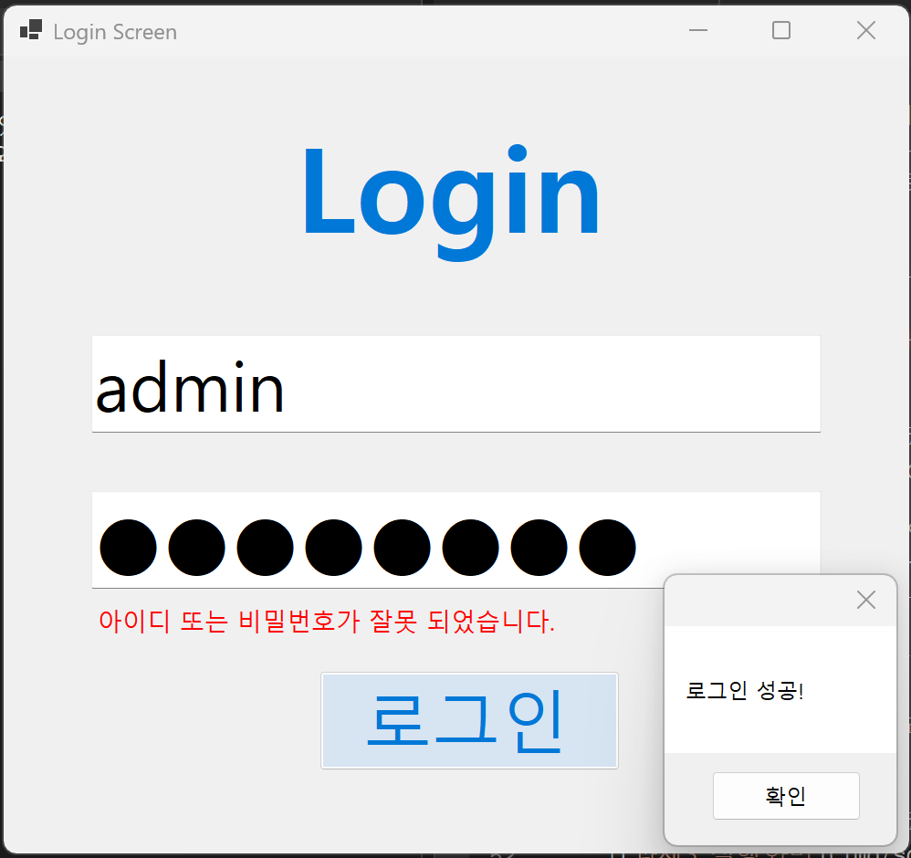
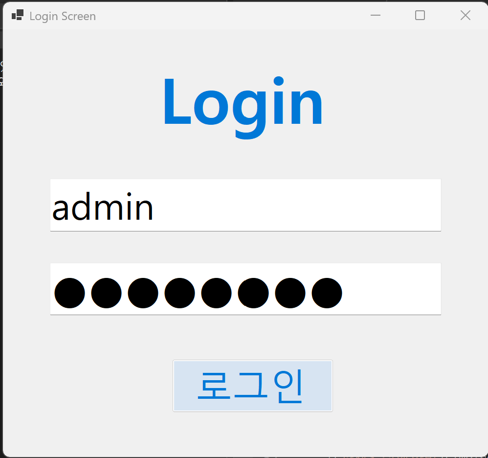

# (C# 코딩) 로그인 스크린

## 개요
- C# 프로그래밍 학습
- 1줄 소개: 아이디와 암호를 검사하여 일치할 때만 화면을 보여주는 '판단력’을 가진 프로그램 제작
- 사용한 플랫폼:
  - C#, .NET Windows Forms, Visual Studio, GitHub
- 사용한 컨트롤:
  - Label, TextBox, Button
- 사용한 기술과 구현한 기능:
 
  - Visual Studio를 이용한 WinForms UI 디자인
  - MessageBox 클래스를 이용한 로그인 결과 알림창 출력
  - Color 클래스를 이용한 텍스트 색상 동적 변경
  - string 클래스를 이용한 입력값과 지정 정보 비교
  - Placeholder 기능을 이용한 입력 가이드 메시지 구현
  - UseSystemPasswordChar 속성을 이용한 비밀번호 가림 처리

  
  - KeyEventArgs 클래스를 이용한 Enter 키 인식 및 비프음 제거
  - Focus 및 PerformClick 메서드를 이용한 입력 흐름 제어
  - Visible 속성을 이용한 실시간 에러 메시지 노출 기능 구현
  - KeyDown 이벤트를 이용한 키보드 로그인 인터페이스 완성

## 실행 화면 (과제1)
- 과제1 코드의 실행 스크린샷

- 과제 내용
  - 메인 화면에 아이디와 패스워드 입력을 위한 TextBox와 로그인 실행을 위한 Button 등을 적절히 배치합니다.
  - 사용자가 입력 위치를 직관적으로 인지할 수 있도록 아이디와 패스워드 입력 힌트를 회색으로 표시합니다.
  - 시스템 보안을 위해 지정된 아이디와 패스워드가 모두 일치해야 로그인이 허용되도록 기능을 구성합니다.
  - 인증 결과에 따라 사용자에게 명확한 피드백을 전달하기 위해 적절한 메시지 박스를 사용합니다.

- 구현 내용과 기능 설명
  - TextBox의 Enter와 Leave 이벤트를 통해 입력 힌트가 사라지거나 나타나는 Placeholder 기능이 수행된다.
  - 힌트 텍스트 상태에서는 Silver 색상이 적용되며 실제 입력을 위해 포커스가 이동하면 Black 색상으로 전환된다.
  - 패스워드 입력창은 UseSystemPasswordChar 속성이 제어되어 입력 내용이 노출되지 않도록 가려진다.
  - 로그인 버튼 클릭 시 입력값과 지정된 정보를 논리 연산자로 대조하여 인증 성공 및 실패 여부가 판단된다.
  - 인증 상태에 따라 MessageBox 클래스가 호출되어 성공 혹은 실패 메시지가 사용자에게 화면으로 전달된다.

## 실행 화면 (과제2)
- 과제2 코드의 실행 스크린샷

- 과제 내용
  - 사용자가 아이디를 입력하고 Enter 키를 누르면 패스워드 입력창으로 포커스가 자동으로 이동하도록 처리합니다.
  - 패스워드를 입력한 뒤 Enter 키를 누르면 로그인 버튼을 누른 것처럼 동작하여 마우스 없이도 로그인이 가능하게 합니다.
  - 키보드만으로 끊김 없는 입력 흐름을 제공하여 사용자가 더 빠르고 편리하게 로그인할 수 있도록 UX를 개선합니다.
  - 아이디 또는 패스워드가 잘못 입력되었을 때 메시지 박스를 띄우지 않고 화면의 라벨을 통해 에러 메시지를 보여줍니다.
  - lblErrorMsg 컨트롤을 추가하고 Visible 속성을 이용하여 상황에 맞게 메시지를 보이거나 숨기는 기능을 구현합니다.
  - 평상시에는 에러 문구가 보이지 않게 처리하고, 로그인 정보가 틀린 경우에만 특정 위치에 경고 메시지를 노출합니다.
	
- 구현 내용과 기능 설명
  - KeyDown 이벤트 핸들러를 사용하여 입력된 키가 Enter 키인지 식별한 뒤 각각의 로직이 수행된다.
  - e.SuppressKeyPress 속성을 true로 설정하여 Enter 키 입력 시 발생하는 시스템 비프음이 방지되고 지정된 동작만 수행된다.
  - txtPW.Focus()와 btnLogin.PerformClick() 메서드를 호출하여 지정한 아이디와 패스워드를 검증하는 과정이 코드로 제어된다.
  - 로그인 버튼 클릭 시 입력된 정보가 지정한 아이디와 패스워드가 일치하지 않으면 에러 라벨의 Visible 속성이 true로 변경되어 오류가 표시된다.
  - 인증에 성공할 경우 성공 알림과 함께 에러 라벨의 Visible 속성이 다시 false로 설정되어 화면이 깨끗하게 정리된다.

